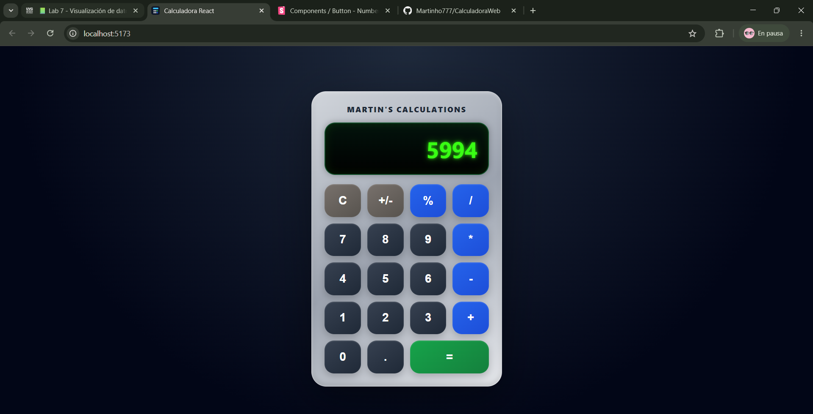

# Calculadora React

**Proyecto 2 - Sistemas Web**  
**Estudiante:** Martin Villatoro  
**Carnet:** 24033

## Descripción

Este proyecto consiste en una calculadora desarrollada con React y TypeScript. La aplicación permite realizar operaciones básicas y algunas funciones adicionales, manteniendo una interfaz visual personalizada y una lógica separada mediante componentes y un hook propio.

La calculadora incluye pantalla de resultados, teclado numérico con botones HTML, operaciones matemáticas, validaciones de límite de caracteres y manejo de errores según los requerimientos del proyecto.

## Vista previa




## Tecnologías utilizadas

- React
- TypeScript
- Vite
- Bun
- Vitest
- React Testing Library
- Storybook
- ESLint
- GitHub Actions

## Funcionalidades implementadas

- Suma
- Resta
- Multiplicación
- División
- Módulo
- Igualdad
- Punto decimal
- Cambio de signo con `+/-`
- Límite de 9 caracteres en pantalla
- Validación de resultados negativos por operación
- Validación de resultados mayores a `999999999`
- Estado `ERROR`
- Hook propio para manejar la lógica de la calculadora
- Componentes separados para botón, display, teclado y calculadora
- Atributos básicos de accesibilidad como `aria-label`
- Diseño visual personalizado
- Title y favicon personalizados

## Instalación

Para instalar las dependencias del proyecto se debe ejecutar:

```bash
bun install
```

## Correr la aplicación

Para ejecutar la aplicación en modo desarrollo:

```bash
bun run dev
```

La aplicación normalmente se abre en:

```txt
http://localhost:5173/
```

## Correr los tests

Para ejecutar las pruebas configuradas con Vitest:

```bash
bun run test
```

## Correr el linter

Para revisar que el código cumpla con las reglas de linting:

```bash
bun run lint
```

El proyecto incluye reglas para evitar el uso de punto y coma y para mantener las líneas con un máximo de 120 caracteres.

## Correr Storybook

Para abrir la documentación visual de componentes:

```bash
bun run storybook
```

Storybook normalmente se abre en:

```txt
http://localhost:6006/
```

## Generar build de producción

Para generar los archivos de producción:

```bash
bun run build
```

Los archivos compilados se generan dentro de la carpeta:

```txt
dist
```

## Generar build de Storybook

Para generar el build estático de Storybook:

```bash
bun run build-storybook
```

## Scripts principales

```json
{
  "dev": "vite",
  "build": "tsc -b && vite build",
  "lint": "eslint \"src/**/*.{js,jsx,ts,tsx}\"",
  "preview": "vite preview",
  "test": "vitest run --config vite.config.ts",
  "storybook": "storybook dev -p 6006",
  "build-storybook": "storybook build"
}
```

## Notas importantes

No se debe subir la carpeta `node_modules` al repositorio ni al servidor de la clase.

El proyecto utiliza Bun como package manager, por lo que el archivo `bun.lock` debe mantenerse en el repositorio.

Para publicar la calculadora en el servidor de la clase, se debe generar primero el build con:

```bash
bun run build
```

Luego se deben subir únicamente los archivos necesarios de producción, normalmente el contenido generado dentro de `dist`.
